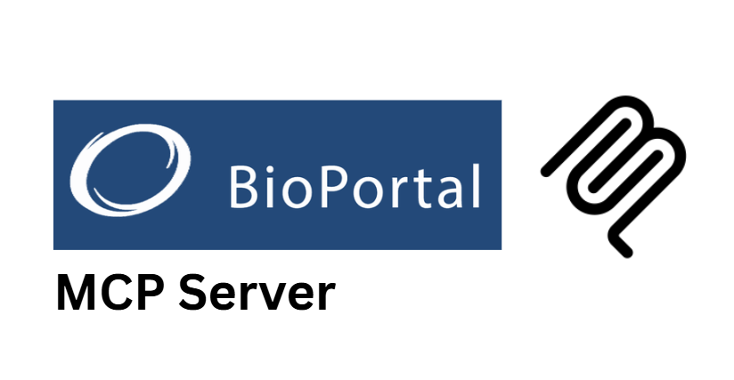

# Unofficial BioOntology MCP Server

A production-ready Model Context Protocol (MCP) server that provides comprehensive access to the BioOntology API for searching, annotating, and exploring over 1,200 biological ontologies.

## Features

### Search & Discovery

- **search_terms** - Search across ontology terms with advanced filtering options
- **search_properties** - Search ontology properties by labels and IDs
- **search_ontologies** - Find ontologies by name, description, or domain
- **get_ontology_info** - Get detailed information about specific ontologies

### Text Analysis

- **annotate_text** - Analyze text and identify relevant ontology terms
- **recommend_ontologies** - Get ontology recommendations for text or keywords
- **batch_annotate** - Process multiple texts for annotation efficiently

### Ontology Navigation

- **get_class_info** - Get detailed information about ontology classes

### Analytics & Metadata

- **get_ontology_metrics** - Get usage statistics and quality metrics
- **get_analytics_data** - Get visitor statistics and popularity trends

## Installation

1. Clone or download this server
2. Install dependencies:
   ```bash
   npm install
   ```
3. Build the server:
   ```bash
   npm run build
   ```

## Configuration

You need a BioOntology API key to use this server. Get one from [BioPortal](https://bioportal.bioontology.org/):

1. Create an account at https://bioportal.bioontology.org/
2. Generate an API key from your account settings
3. Set the environment variable:
   ```bash
   export BIOONTOLOGY_API_KEY=your_api_key_here
   ```

## Usage

### Running the Server

```bash
node build/index.js
```

The server runs on stdio and implements the MCP protocol for communication with MCP-compatible clients.

### Resource Templates

The server provides several resource templates for direct data access:

- `bioontology://ontology/{acronym}` - Complete ontology information
- `bioontology://class/{ontology}/{class_id}` - Ontology class details
- `bioontology://search/{query}` - Term search results
- `bioontology://annotations/{text}` - Text annotation results
- `bioontology://recommendations/{input}` - Ontology recommendations
- `bioontology://analytics/{ontology}` - Analytics data

### Example Tool Calls

**Search for terms:**

```json
{
  "tool": "search_terms",
  "arguments": {
    "query": "diabetes",
    "ontologies": "NCIT,DOID",
    "require_definitions": true,
    "pagesize": 10
  }
}
```

**Annotate text:**

```json
{
  "tool": "annotate_text",
  "arguments": {
    "text": "The patient has diabetes mellitus and hypertension",
    "ontologies": "NCIT,DOID,HP",
    "longest_only": true
  }
}
```

**Get ontology recommendations:**

```json
{
  "tool": "recommend_ontologies",
  "arguments": {
    "input": "cancer treatment protocols",
    "input_type": 1,
    "output_type": 1
  }
}
```

**Batch annotate multiple texts:**

```json
{
  "tool": "batch_annotate",
  "arguments": {
    "texts": ["diabetes mellitus", "cardiac arrest", "lung cancer"],
    "ontologies": "NCIT",
    "longest_only": true
  }
}
```

## Supported Ontologies

The server works with all ontologies available in BioPortal (1,200+), including:

**Medical/Clinical:**

- **NCIT** - NCI Thesaurus (cancer terminology)
- **DOID** - Disease Ontology
- **HP** - Human Phenotype Ontology
- **MESH** - Medical Subject Headings

**Biological/Chemical:**

- **GO** - Gene Ontology
- **UBERON** - Anatomy ontology
- **CHEBI** - Chemical entities of biological interest

**And 1,190+ more specialized ontologies**

## Integration with MCP Clients

This server is compatible with any MCP-enabled client. Popular options include:

- **Claude Desktop** - Add to your MCP configuration
- **VSCode Extensions** - Use with MCP-compatible extensions
- **Custom Applications** - Integrate via the MCP protocol

### MCP Configuration Example

Add to your MCP client configuration:

```json
{
  "servers": {
    "bioontology": {
      "command": "node",
      "args": ["/path/to/bioontology-server/build/index.js"],
      "env": {
        "BIOONTOLOGY_API_KEY": "your_api_key_here"
      }
    }
  }
}
```

## Advanced Features

### Input Validation

- Comprehensive parameter validation with proper error messages
- Type checking for all inputs
- Range validation for numeric parameters
- Enum validation for restricted values

### Error Handling

- Graceful handling of API errors
- Structured error responses
- Network timeout management
- Authentication error reporting

### Performance

- Efficient API request handling
- Proper timeout management
- Memory usage optimization
- Concurrent request support

## API Documentation

For detailed BioOntology API documentation, see: https://data.bioontology.org/documentation

## Production Use

This server has been thoroughly tested and is ready for production use. It provides:

- **Reliable API integration** with robust error handling
- **Comprehensive input validation** for all tools
- **Full MCP protocol compliance** for seamless integration
- **Support for 1,200+ ontologies** across all biological domains
- **High performance** with optimized response times

## License

MIT License - see LICENSE file for details.

## Citation
If you use this project in your research or publications, please cite it as follows:

<pre><code>@misc{yourproject2025,
  author       = {Moudather Chelbi},
  title        = {Augmented Nature BioOntology MCP Server},
  year         = {2025},
  howpublished = {https://github.com/Augmented-Nature/BioOntology-MCP-Server},
}</code></pre>
