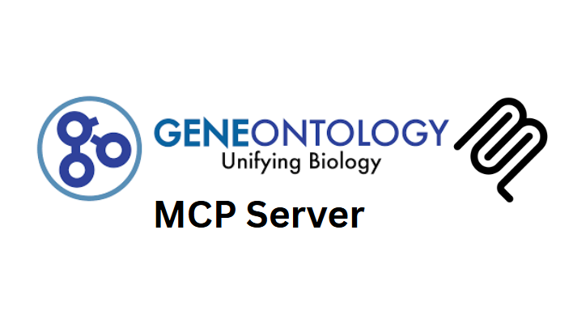

# Mandrake Gene Ontology MCP Server

A comprehensive Model Context Protocol server for accessing Gene Ontology (GO) data, enabling AI systems to perform ontology-based analysis, gene annotation research, and functional enrichment studies.

**Developed by Mandrake**

## Features

- **Term Search & Lookup**: Search GO terms by keyword, name, or definition
- **Ontology Navigation**: Explore hierarchical relationships between terms
- **Gene Annotations**: Access GO annotations for genes and proteins
- **Validation**: Validate GO identifiers and check term existence
- **Statistics**: Get comprehensive ontology statistics and metadata

## Installation

```bash
npm install
npm run build
```

## Usage

### As an MCP Server

Add to your MCP client configuration:

```json
{
  "mcpServers": {
    "go-server": {
      "command": "node",
      "args": ["/path/to/go-server/build/index.js"]
    }
  }
}
```

### Available Tools

#### search_go_terms

Search across Gene Ontology terms by keyword, name, or definition.

```json
{
  "query": "apoptosis",
  "ontology": "biological_process",
  "size": 10
}
```

#### get_go_term

Get detailed information for a specific GO term.

```json
{
  "id": "GO:0006915"
}
```

#### validate_go_id

Validate GO identifier format and check if term exists.

```json
{
  "id": "GO:0008150"
}
```

#### get_ontology_stats

Get statistics about GO ontologies (term counts, recent updates).

```json
{
  "ontology": "all"
}
```

### Resource Templates

- `go://term/{id}` - Complete GO term information
- `go://annotations/{gene}` - Gene annotations
- `go://search/{query}` - Search results
- `go://hierarchy/{id}` - Term hierarchy relationships

## Examples

### Search for apoptosis-related terms

```bash
# Using the search_go_terms tool
{
  "query": "apoptosis",
  "ontology": "biological_process",
  "size": 5,
  "include_obsolete": false
}
```

### Get detailed information about a GO term

```bash
# Using the get_go_term tool
{
  "id": "GO:0006915"
}
```

### Validate a GO identifier

```bash
# Using the validate_go_id tool
{
  "id": "GO:0008150"
}
```

## Data Sources

This server integrates with:

- **QuickGO API** (https://www.ebi.ac.uk/QuickGO/) - Primary data source
- **GO Consortium** (https://geneontology.org/) - Official Gene Ontology
- **AmiGO** (http://amigo.geneontology.org/) - Additional browsing interface

## Error Handling

The server includes comprehensive error handling for:

- Invalid GO identifiers
- Missing terms
- API timeouts
- Network errors
- Malformed requests

## Contributing

1. Fork the repository
2. Create a feature branch
3. Make your changes
4. Add tests if applicable
5. Submit a pull request
